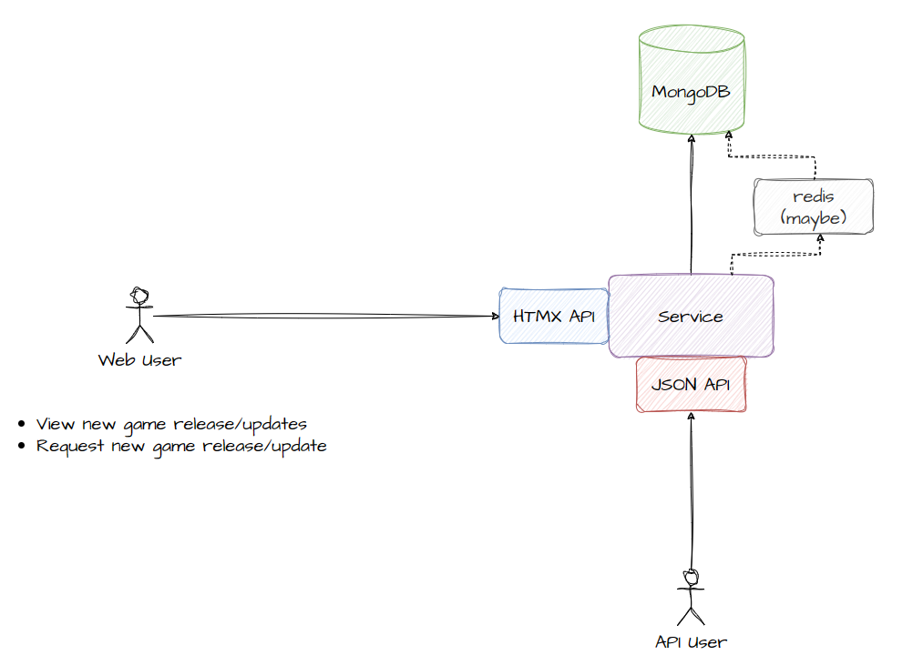

# traffix
Basic API to provide insights for major bandwidth spike events on the internet for ISPs. For example new game release or updates.

This project is split into different phases of development to set achievable goals for myself. Currently this is split into 3 phases.

## Phase 1

Popular game releases/updates and generic updates (eg. Microsoft Windows or Apple iOS) will be added to the database manually. Users can request to enter details that are not already available on the API but these will be reviewed manually by contributers (or the community itself). This is to focus purely on the basic UI development and workflow before attempting to streamline multiple sources of data and automate the collection of various APIs. In this phase I expect the following key features to be implemented:

- Basic API
- API rate limiting
- Database implementation
- Potentially Redis but this may come at Phase 2 unless the project takes off before phase 2
- Mostly monolithic based application but with room to grow into microservices if it becomes popular

## Phase 2

- Streamline of data input from APIs that provide rough storage requirements and details regarding an update/release (only games at this point, eg. Steam, EpicGames, Battlenet, Origin, etc...)
- Historical data from networks who provide stats publicly in attempt to gather estimated traffic patterns in various geo locations
- RSS Feed or some kind of webhook to provide live updates when a game is added to the database

## Phase 3
- Streamline of data input from APIs (other services that are not just game digital distribution platforms) like OS updates/releases, new films/series, and maybe more...
- More cool stuff? Maybe a public UI/Frontend

## Some notes to format/rearrange in the future

RU = Release or Update
RU Base model contains most fields for a Release or an Update

Release = New game, new software or new operating system
Update = Patch/Fix/DLC

An Update must reference a Release

A release has a Publisher, Developer and one or more platforms. Some scenarios documented below:

Game released (Starfield) which was developed by Bethesda Game Studios (Developer), published by Bethesda Softworks (Publisher) on Steam and Xbox series X/S (Platforms). I don't want to put Windows as the Platform... Platforms include but not limited to:

Steam
Epic Games
Battle.net
Origin
Ubisoft Connect
Playstation
Microsoft Store

Technically the "platform" I am actually using instead of something like "digital distribution platform", in this case platform != hardware (eg. Playstation 4 vs Xbox One vs PC)

Developers, Publishers and Platforms can not be created using API/Website, if one is to be suggested, use GitHub issues to discuss.

Probably won't even created a "Platform" database table, as this will tie heavily into the automated feed in phase 2/3. Probably will be classes and enums for the Release database entry to assosicate the correct class in the event that some logic needs to run on the server when pulling data for a single release.

A platform can be assigned multiple CDNs, but this is very dependent on 3rd party information and research. Monthly reviews should occur or quartly season reviews because if the platform does not release this information publicly via FAQs or other methods, this is dependent on things like packet captures and investigating NAT rules to find the destination IP address of traffic when downloading the relevant release/update. For example, I think Microsoft can use their own or Akamai CDN hosting to deliver game releases/updates to subscribers but its very vague in articles I've found so far after a few mins of research...

Each platform will be assigned a "weight" because a game Release can be distributed on multiple platforms. Probably a generic database table will hold the release, and platform specific tables will hold meta data (eg. different estimated_size or real_size of the software to download), weight would be irrelevant if this happens... I can imagine a separate microservice API ingestor will need to be introduced on a per-platform basis as it will be a lot of API scraping / requests / unique logic for each platform.

Categories can be assigned to a release (update should inherit this or have separate tags? probably separate...), NSFW tag should blur thumbnail image on frontend UI.

### Development

Needs more work but:

1. Create `.env` file
2. `docker compose -f docker-compose-dev.yml up --build`
3. Create self-signed cert `openssl req -new -newkey rsa:4096 -x509 -sha256 -days 365 -nodes -out MyCertificate.crt -keyout MyKey.key`, images loaded over HTTPs might not appear properly when testing https
4. Initial data will be imported on app startup
5. First 100 releases and updates will be pull on app startup and stored into redis so that the UI and API endpoints work for obtaining release/updates